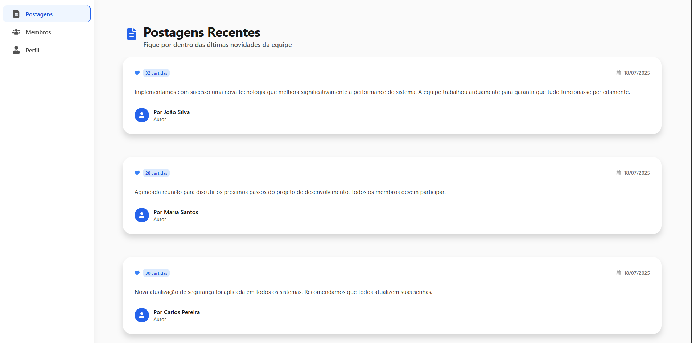
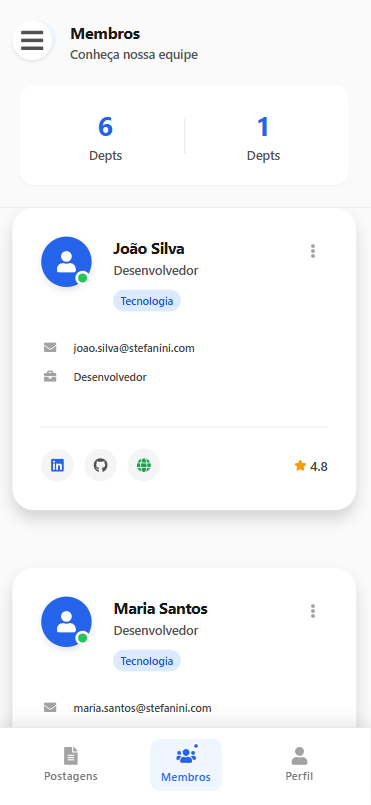

# 🚀 Frontend Monorepo – Stefanini Brasil

Monorepo front-end construído com **React Native Web**, **TypeScript** e **Yarn Workspaces**.

---

## 🏗️ Estrutura do Projeto

```
frontend-monorepo/
├── apps/
│   └── app/                 # Aplicação React Native Web
├── packages/
│   ├── ui/                  # Pacote de componentes UI
│   └── layout/              # Pacote de componentes de layout
└── package.json             # Configuração do workspace
```

---

## 📦 Pacotes

### 🎨 @stefanini/ui
Pacote de componentes UI reutilizáveis:
- 🟦 **Button**
- 🃏 **Card**
- 📋 **ListItem**
- 👤 **Avatar**
- 🏷️ **Badge**
- ⏳ **LoadingSpinner**
- 🎯 **Icon** (com suporte a múltiplos ícones do React Icons)

### 🧩 @stefanini/layout
Pacote de componentes de layout:
- 🏠 **Header**
- 🚪 **Footer**
- 📚 **Sidebar**
- 📦 **Container**
- 🧭 **Navigation**
- 📱 **BottomNavigation**

---

## ⚡ Como Executar

### Pré-requisitos
- Node.js 18+
- Yarn 1.22+
- **Backend rodando** (ver instruções no README do backend)
- **Redis rodando** (via Docker, ver instruções no backend)
- **MySQL/MariaDB** configurado (via phpMyAdmin ou Docker)

### Instalação

1. Clone o repositório:
   ```bash
   git clone <url-do-repositorio>
   cd frontend-monorepo
   ```

2. Instale as dependências:
   ```bash
   yarn install
   ```

3. Construa os pacotes:
   ```bash
   yarn workspace @stefanini/ui build
   yarn workspace @stefanini/layout build
   ```

4. Execute a aplicação:
   ```bash
   yarn dev
   ```

A aplicação estará disponível em [http://localhost:3000](http://localhost:3000)

---

## 🔗 Integração com o Backend

- Certifique-se de que o backend está rodando em [http://localhost:3001](http://localhost:3001)
- O frontend consome os endpoints `/members` e `/posts` do backend
- **Dados reais**: A aplicação usa apenas dados reais do banco MySQL/MariaDB
- **Sem dados mock**: Não há fallback para dados estáticos
- **Cache Redis**: Backend utiliza cache para otimização de performance
- **Tratamento de erros**: Interface mostra mensagens claras quando não há dados

---

## 📱 Funcionalidades

- **Navegação Responsiva**:  
  - 💻 **Desktop/Web**: Sidebar fixa lateral com navegação vertical
  - 📱 **Mobile**: Bottom navigation + drawer lateral (hamburger menu)

- **Telas**:  
  1. 📝 **Postagens**: lista de postagens com cards informativos  
  2. 👥 **Membros**: lista de membros da equipe com avatares e badges
  3. 👤 **Perfil**: tela de perfil do usuário com dados reais do banco

- **Componentes Reutilizáveis**:  
  - Compartilhados entre web e mobile  
  - Design system consistente  
  - Suporte a temas e variantes

- **Tratamento de Erros**:  
  - Interface de erro quando não há dados do backend
  - Mensagens claras sobre problemas de conexão
  - Formatação robusta de datas (DD/MM/AAAA)

---

## 📸 Screenshots do Sistema

### 💻 Interface Web/Desktop

*Interface principal do sistema com sidebar lateral, navegação vertical e layout responsivo para desktop*

### 📱 Interface Mobile

*Interface mobile com bottom navigation, drawer lateral e layout otimizado para dispositivos móveis*

---

**Características das Interfaces:**

#### 💻 **Versão Web/Desktop**
- Sidebar fixa lateral com navegação vertical
- Layout responsivo com grid adaptativo
- Componentes otimizados para telas maiores
- Navegação intuitiva entre telas (Postagens, Membros, Perfil)

#### 📱 **Versão Mobile**
- Bottom navigation para navegação principal
- Drawer lateral (hamburger menu) para funcionalidades adicionais
- Layout otimizado para telas menores
- Componentes adaptados para touch e gestos
- Interface limpa e focada na usabilidade mobile

---

## 🛠️ Scripts Disponíveis

- `yarn dev` – Inicia o servidor de desenvolvimento
- `yarn build` – Constrói a aplicação para produção
- `yarn test` – Executa os testes
- `yarn lint` – Executa o linter

---

## 🧑‍💻 Tecnologias Utilizadas

- **React 18**
- **React Native Web**
- **TypeScript**
- **Yarn Workspaces**
- **React Scripts**
- **Axios** (integração com API)
- **React Icons** (ícones)
- **React App Rewired** (configuração customizada)

---

## 🎨 Design System

O projeto utiliza um design system consistente com:
- 🎨 Cores padronizadas
- 🔠 Tipografia hierárquica
- 📏 Espaçamentos consistentes
- 🧩 Componentes reutilizáveis

---

## 📱 Responsividade

A aplicação é totalmente responsiva e funciona em:
- 💻 **Desktop** (sidebar fixa lateral)
- 📱 **Mobile** (bottom navigation + drawer)
- 🖥️ **Tablet** (sidebar fixa lateral)

---

## 🔧 Desenvolvimento

Para desenvolver novos componentes:

1. Adicione o componente no pacote apropriado (`ui` ou `layout`)
2. Exporte o componente no `index.ts` do pacote
3. Construa o pacote: `yarn workspace @stefanini/ui build` ou `yarn workspace @stefanini/layout build`
4. Importe e use na aplicação

### **⚠️ Importante:**
- Sempre rebuild os pacotes após modificar componentes: `yarn workspace @stefanini/ui build`
- O frontend usa `react-app-rewired` para configuração customizada
- Os dados são carregados via Axios do backend em `http://localhost:3001`
- **Formatação de datas**: Implementada formatação robusta DD/MM/AAAA
- **Tratamento de erros**: Interface amigável para problemas de conexão

### **🔍 Verificação de Dados:**
- Se houver erro, verifique se o backend está rodando e tem dados no banco
- **Dados reais**: A aplicação usa apenas dados do banco MySQL/MariaDB
- **Cache**: Backend utiliza Redis para otimização de performance

---

## 📸 Screenshots do Sistema

O projeto inclui duas screenshots principais que demonstram a responsividade da aplicação:

### 💻 **Interface Web/Desktop** (`tela-inicial.PNG`)
- Captura da interface principal em desktop
- Mostra a sidebar lateral e navegação vertical
- Demonstra o layout responsivo para telas maiores

### 📱 **Interface Mobile** (`tela-mobile.PNG`)
- Captura da interface mobile
- Mostra o bottom navigation e layout adaptado
- Demonstra a adaptação para dispositivos móveis

---

**Para capturar novas screenshots:**

1. **Execute o sistema**:
   ```bash
   yarn dev
   ```

2. **Capture as telas**:
   - Abra `http://localhost:3000`
   - Use DevTools para simular dispositivos móveis
   - Capture as interfaces em diferentes resoluções

3. **Salve as imagens**:
   - Salve as screenshots na raiz do projeto
   - Formato: PNG com boa qualidade
   - Nomes sugeridos: `tela-inicial.PNG`, `tela-mobile.PNG`

---

## 📄 Licença

Este projeto é open source e está disponível sob a licença MIT. 